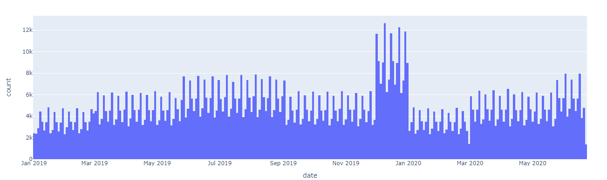
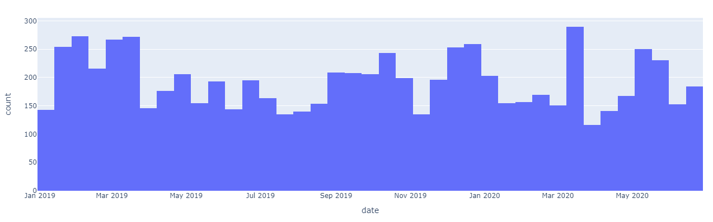
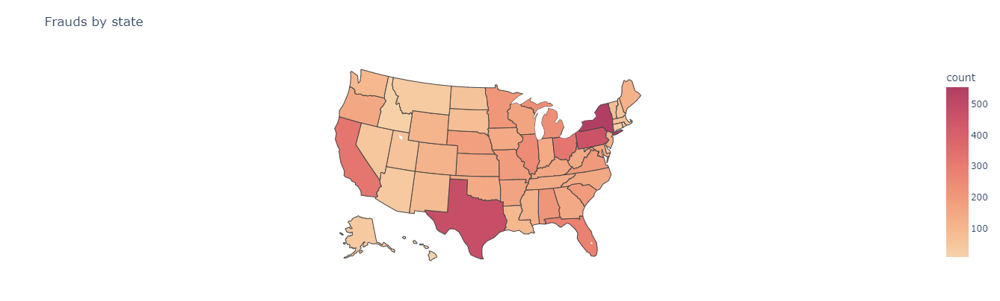
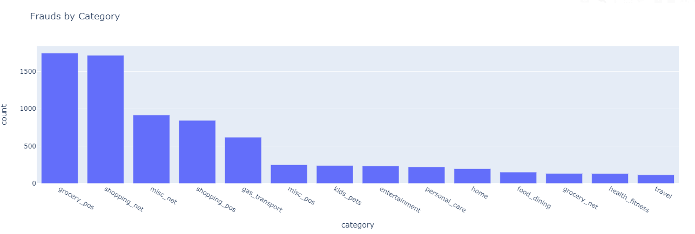

# Credit Card Transactions Fraud Detection via Continual Learning

## Feladat
A feladatunk egy a Kaggleről származó [generált](https://github.com/namebrandon/Sparkov_Data_Generation) bankkártyás tranzakciók [adathalmazának](https://www.kaggle.com/datasets/kartik2112/fraud-detection?resource=download) feldolgozása és folyamatos tanulással történő csalásdetekciója lesz.

Szeretnénk a detekciót első körben egy nem deeplearninges módszerrel megvalósítani, continual learning nélkül. Ezt követően a continual learninget is bevezetnénk, és összehasonlítanánk a két módszert.

Ezen kívül szeretnénk kipróbálni egy [szakmai cikkben](https://arxiv.org/pdf/1903.07293.pdf) talált gráf-neurál hálós [implementációt](https://github.com/Jhy1993/HAN) is.

## Adathalmaz

Rendelkezünk előre címkézett tanítóadattal, és a tesztadatokkal is. Az adathalmazban a tranzakciók időpontja, összege, valamint a tranzakcióhoz tartozó kártya azonosítója, a kártya tulajdonosának adatai és a tranzakció sikerességének címkéje is megtalálható.

[Report](https://htmlpreview.github.io/?https://github.com/botondklenk/continual-fraud/blob/main/report.html)

Transactions by time:

Frauds by time:

Frauds by states:

Frauds by categories:

## Megoldások

A continual learninget államokra és idő alapján bontva is szeretnénk kipróbálni.

## Lépések

- [x] Adathalmaz elemzése
- [ ] Adatok feldolgozása
    - [ ] Adatelőkészítés
    - [ ] Adat betöltő osztály készítése
    - [ ] Csoportokra bontás
    - [ ] További elemzés
- [ ] Baseline modell kiválasztása
- [ ] Baseline modell tanítása
    - [ ] Dataset balancing
- [ ] Baseline modell kiértékelése
- [ ] Continual learning bevezetése
- [ ] Modell kiértékelése continual learninggel
- [ ] Gráf-neurál háló implementációja
- [ ] Modell kiértékelése gráf-neurál hálóval
- [ ] Összehasonlítás
- [ ] Konklúzió
