# Credit Card Transactions Fraud Detection via Continual Learning
## Adathalmaz elemzés

Benyák Bence - Klenk Botond

A feladatunk egy a Kaggleről származó generált bankkártyás tranzakciók adathalmazának feldolgozása és folyamatos tanulással történő csalásdetekciója lesz.

### Adathalmaz

- **Időpont**: Az adathalmazban szereplő tranzakciók időbélyege (trans_date_trans_time)
- **Összeg**: A tranzakció összege (amt)
- **Kártytulajdonos**: A tranzakcióhoz tartozó kártya tulajdonosának adatai (cc_num, first, last, gender, street, city, state, zip, lat, long, city_pop, job, dob)
- **Kereskedő**: A tranzakciót végrehajtó kereskedő adatai (merchant, category, merch_lat, merch_long)
- **Csalás**: A tranzakció csalás volt-e vagy sem (is_fraud)

### Sample adatok

| trans_date_trans_time | cc_num | merchant | category | amt | first | last | gender | street | city | state | zip | lat | long | city_pop | job | dob | trans_num | unix_time | merch_lat | merch_long | is_fraud |
| --- | --- | --- | --- | --- | --- | --- | --- | --- | --- | --- | --- | --- | --- | --- | --- | --- | --- | --- | --- | --- | --- |
| 2019-01-01 00:00:18 | 2703186189652095 | fraud_Rippin, Kub and Mann | misc_net | 4.97 | Jennifer | Banks | F | 561 Perry Cove | Moravian Falls | NC | 28654 | 36.0788 | -81.1781 | 3495 | Psychologist, counselling | 1988-03-09 | 0b242abb623afc578575680df30655b9 | 1325376018 | 36.011293 | -82.048315 | 0 |
| 2019-01-01 00:00:44 | 630423337322 | fraud_Heller, Gutmann and Zieme | grocery_pos | 107.23 | Stephanie | Gill | F | 43039 Riley Greens Suite 393 | Orient | WA | 99160 | 48.8878 | -118.2105 | 149 | Special educational needs teacher | 1978-06-21 | 1f76529f8574734946361c461b024d99 | 1325376044 | 49.159047 | -118.186462 | 0 |
| 2019-01-01 00:00:51 | 38859492057661 | fraud_Lind-Buckridge | entertainment | 220.11 | Edward | Sanchez | M | 594 White Dale Suite 530 | Malad City | ID | 83252 | 42.1808 | -112.2620 | 4154 | Nature conservation officer | 1962-01-19 | a1a22d70485983eac12b5b88dad1cf95 | 1325376051 | 43.150704 | -112.154481 | 0 |
| 2019-01-01 00:01:16 | 3534093764340240 | fraud_Kutch, Hermiston and Farrell | gas_transport | 45.00 | Jeremy | White | M | 9443 Cynthia Court Apt. 038 | Boulder | MT | 59632 | 46.2306 | -112.1138 | 1939 | Patent attorney | 1967-01-12 | 6b849c168bdad6f867558c3793159a81 | 1325376076 | 47.034331 | -112.561071 | 0 |
| 2019-01-01 00:03:06 | 375534208663984 | fraud_Keeling-Crist | misc_pos | 41.96 | Tyler | Garcia | M | 408 Bradley Rest | Doe Hill | VA | 24433 | 38.4207 | -79.4629 | 99 | Dance movement psychotherapist | 1986-03-28 | a41d7549acf90789359a9aa5346dcb46 | 1325376186 | 38.674999 | -78.632459 | 0 |

## Profiling

Az adathalmazról készítettünk egy reportot a `ydata_profiling` segítségével.

Ez a következőkez tartalmazza:
- **Általános információk**: Az adathalmaz mérete, a hiányzó adatok száma, a duplikált sorok száma
- **Változók**: Az adathalmazban szereplő változók listája, és azok elemzése
- **Interakciók**: Az adathalmazban szereplő változók közötti interakciók elemzése
- **Korreláció**: A változók közötti korreláció
- **Hiányzó adatok**: Az adathalmazban szereplő hiányzó adatok elemzése

A report és egyébként az összes grafikon a `data_analysis.html` fájlban interaktív formában megtalálható.

## Csalások vizsgálata

Először a csalások eloszlását szeretnénk megvizsgálni különböző szempontok szerint, összehasonlítva az összes tranzakió eloszlásával.

### Csalások eloszlása

Az adathalmazban szereplő tranzakciók 0.579%-a csalás. Így az adathalmaz egyenlőtlen eloszlású (unbalanced).

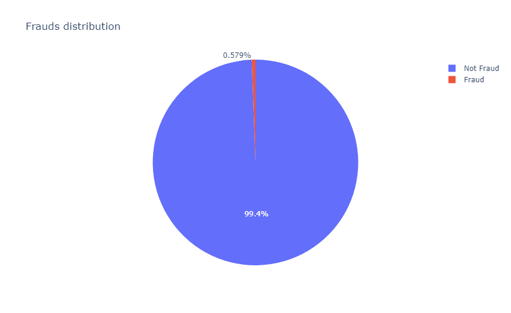

### Időbeliség

A tranzakciók időbeliségében látható periodikus mintázat, viszont a csalások eloszlása ezt nem követi.

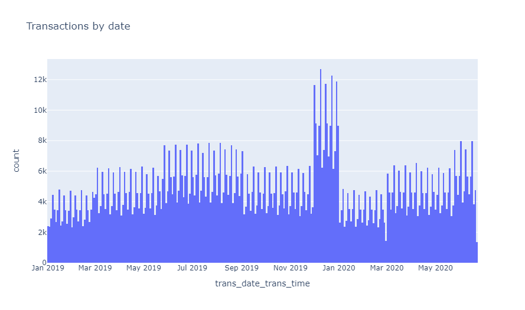
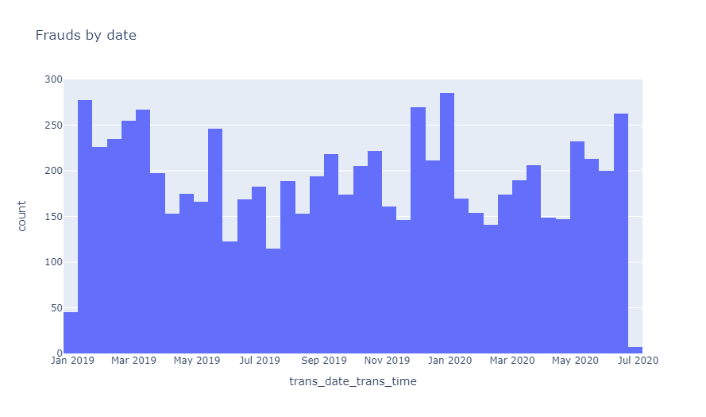

### Államok

Az államokban a tranzakiók száma eltérő, de a csalások eloszlásában csak kis eltérések vannak.

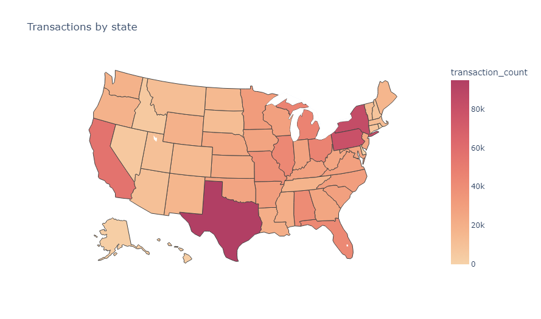
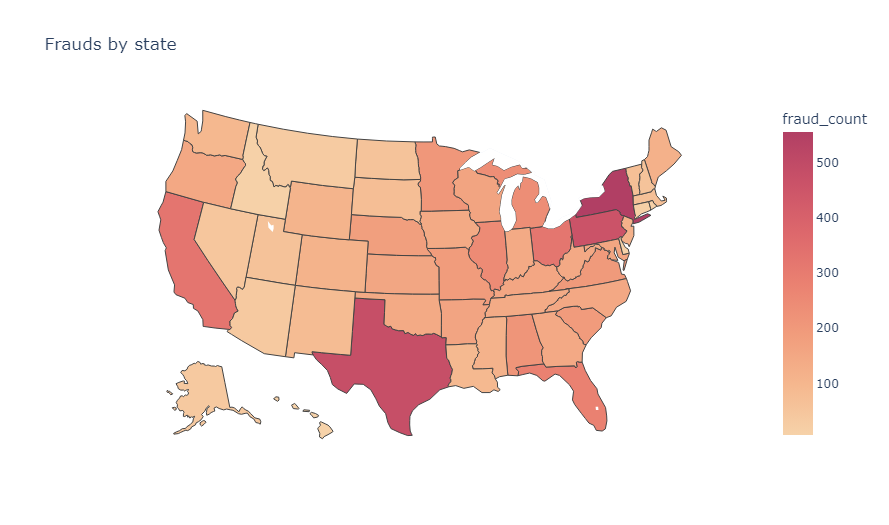
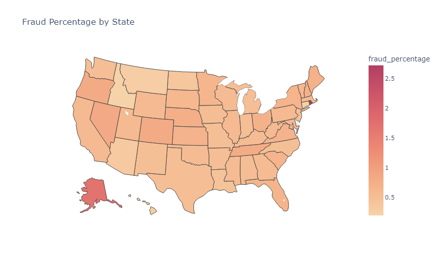

### Kategóriák

Kategóriák szerint a csalások száma nagy eltéréseket mutat, így ezt érdemes figyelembe venni a modell készítésekor.

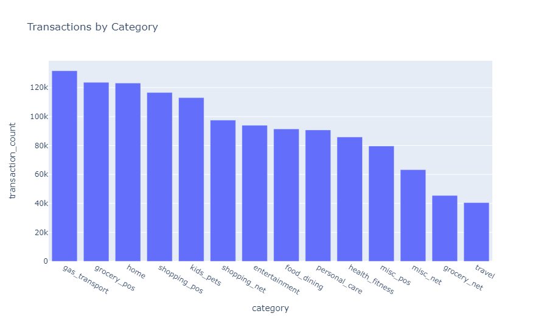
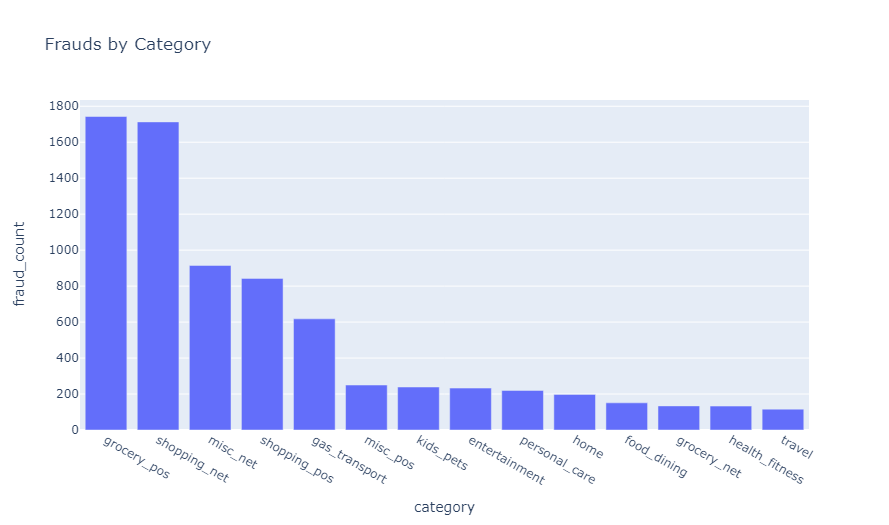
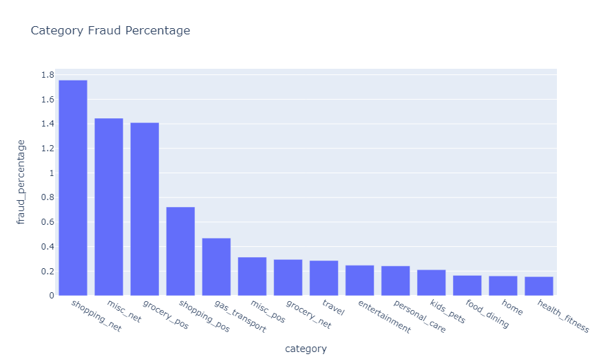

### Nemek

A nemek szerinti csalások eloszlása közel azonos.

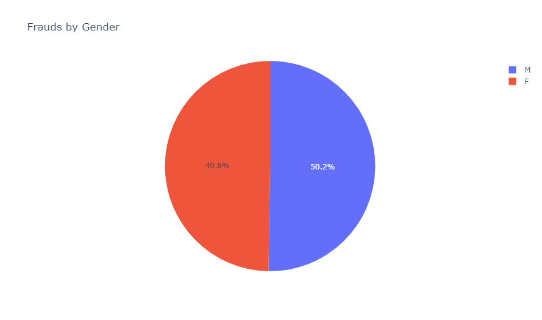

### Életkor

Életkor szerint vannak kiufró értékek, elősorban az idősek közötti százalékos értékben.

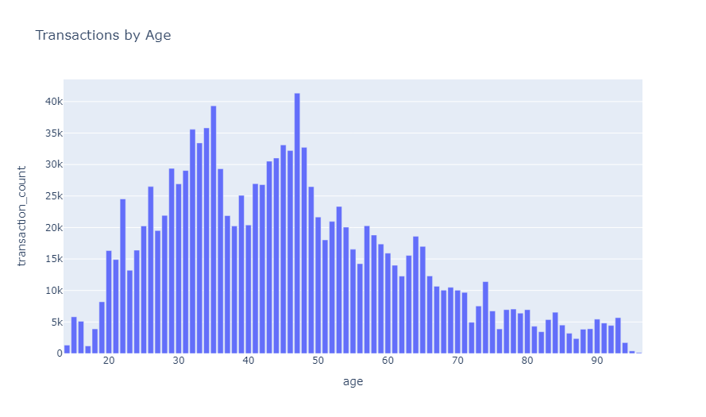
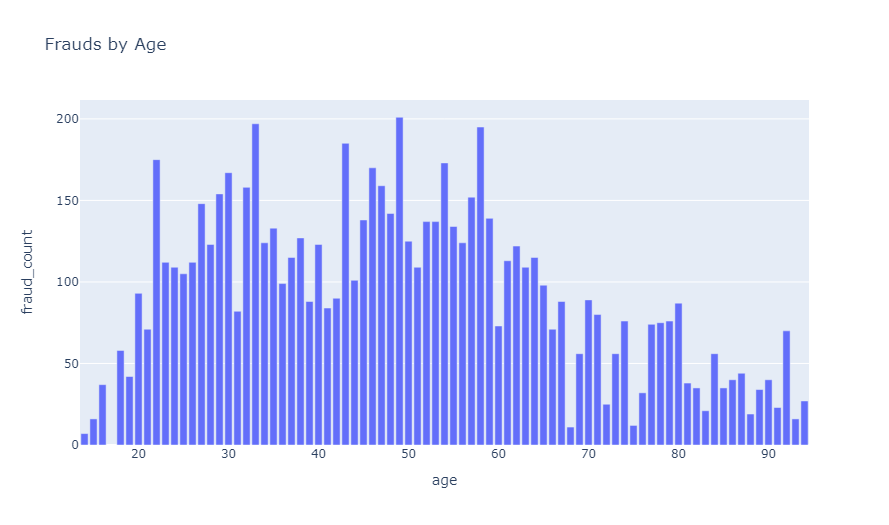
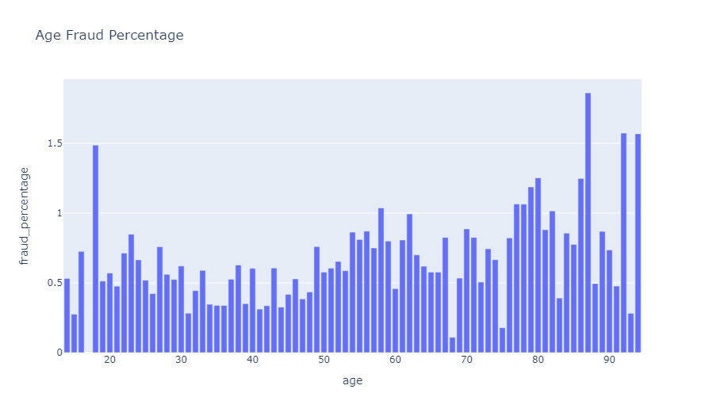

### Városok

A városoknál kardinalitás nagy így csak a top 10-et mutatjuk.

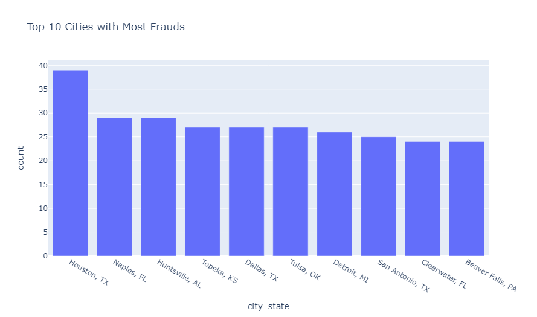

### Kereskedők

A kereskedők között is nagy kardinalitás van, így itt is csak a top 10-et mutatjuk.

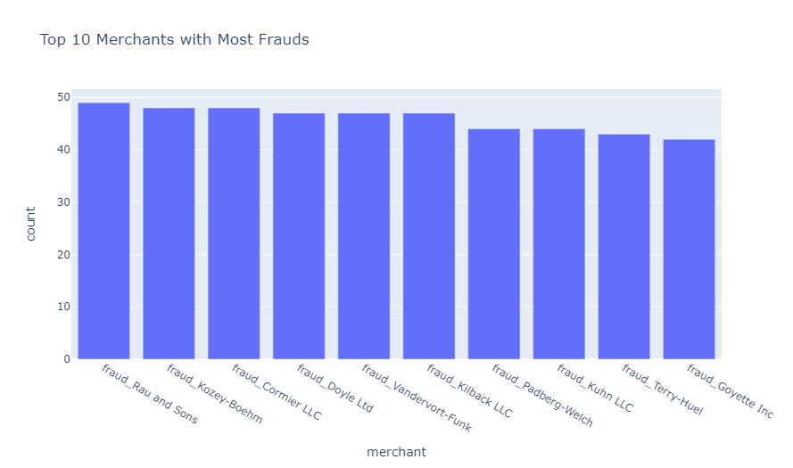
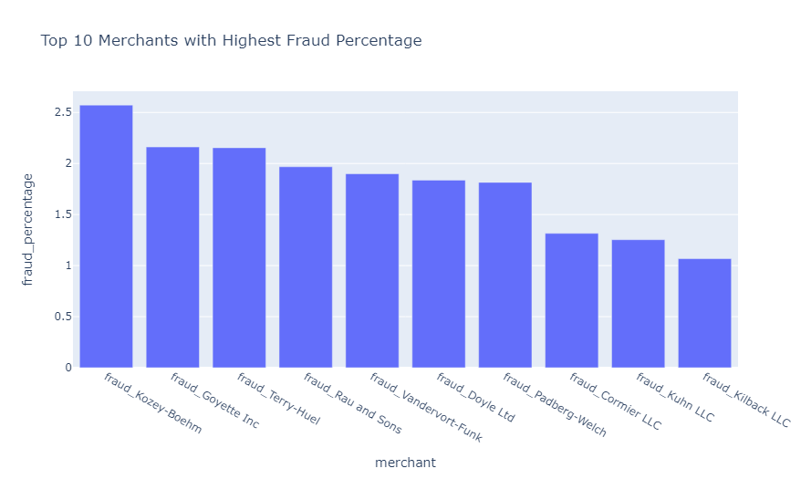

### Munkák

A munkáknál a nagy kardinalitáson kivűl sokra igaz hogy bizonyos munkáknál minden tranzakció csalás. (erre a 19 munkára igaz) Ezt ki lehetne használni a modell készítésekor.

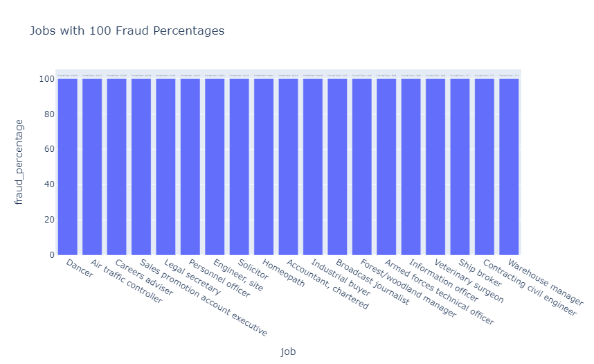

### Összeg

A csalás tarnzakiók összege átlagosan sokkal nagyobb mint a nem csalásoké.

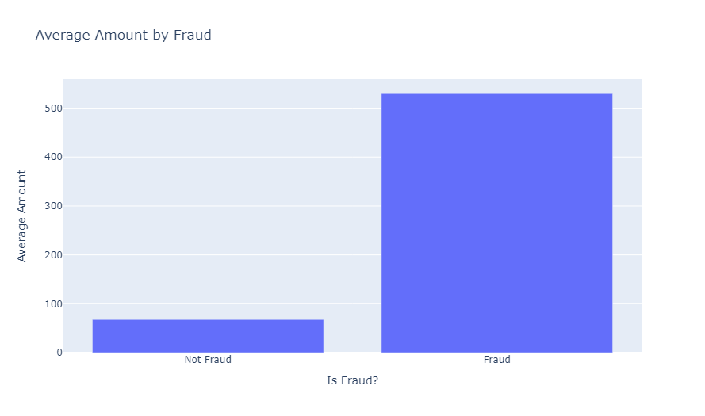

### Távolság a kereskedőtől

Vizsgáltuk a távolságot a kereskedő elhelyezkedése és a kártya tulajdonosának lakóhelye között, de nem találtunk összefüggést a csalásokkal.

Average distance for the whole dataframe: 76.11465060395156 km \
Average distance for the frauds: 76.268329626882 km

Így a pozíciót egyelőre nem vesszük figyelembe a modell készítésekor. \
Rekkurens megoldásoknál érdemes lehetne a legutóbbihoz képesti transzakció távolságát vizsgálni.

### Városban élők száma

Itt azt láthatjuk, hogy nagyobb városokban élők több csalást követnek el.

Average city_pop for the whole dataframe: 88824.44056297839 \
Average city_pop for the frauds: 97276.76325606182

### Idősoros adatok

Az adathalmaz idősoros volt amiatt érdemes lehet az időpontot több féle képpen is elmenteni és azzal korrelációt vizsgálni. A hónap illetve az óra mutat valamilyen korrelációt a csalásokkal.

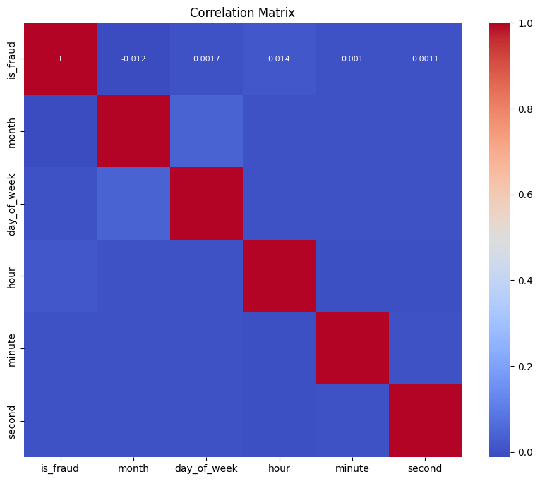

### A személy-cc_num kapcsolat?

Megvizsgáltuk azt is, hogy egy kártya csak egy emberhez tartozik-e, és azt találtuk, hogy igen. \
Ezen kívűl kiderült, hogy pár ember van ugyan azzal a névvel de különböző date of birth-el.

### Tranzakciók egymás után

Nem találtunk olyan mintázatot, ami alapján meg lehetne mondani, hogy mikor kezd el egy kártya csalásokat elkövetni. Van, hogy csak egy csalás van, van, hogy több is.
