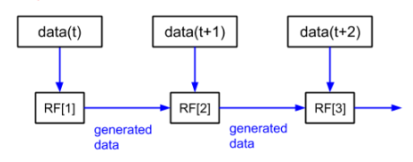

# Credit Card Transactions Fraud Detection via Continual Learning
## ML modellek alkalmazása

Benyák Bence - Klenk Botond

A feladatunk egy a Kaggleről származó generált bankkártyás tranzakciók adathalmazának feldolgozása és folyamatos tanulással történő csalásdetekciója lesz.

## Kiértékelés

A kiértékeléshez a következő metrikákat fogjuk használni:

- Accuracy
- Precision
- Recall
- F1 Score

Mivel a csalások aránya nagyon alacsony az adathalmazban, ezért a Precision és Recall metrikák (és a belőlük számolt F1 score) lesznek a legfontosabbak.

## RandomForestClassifier baseline model

A baseline modelünk egy RandomForestClassifier lesz, amit a feldolgozott adathalmazon fogunk betanítani.
Ehhez készítettünk egy `RFCModel` osztályt, ami a `sklearn.ensemble.RandomForestClassifier`-t használja.

### Smote nélkül

```python
prep = DataPreparation()
scaler = StandardScaler()
rfc = RFCModel(n_estimators=80)
baseline_pipeline = make_pipeline(prep, scaler, rfc)
baseline_pipeline.fit(X_train, y_train)
```

#### Confusion matrix:

|                   | Predicted Not Fraud | Predicted Fraud |
|-------------------|---------------------|-----------------|
| Actual Not Fraud  | 553482              | 92              |
| Actual Fraud      | 655                 | 1490            |

#### Scores:

| Random Forest with | accuracy  | precision | recall   | f1_score |
|--------------------|-----------|-----------|----------|----------|
| No Under/Oversampling | 0.998656 | 0.941846  | 0.694639 | 0.799571 |

Látható hogy a modellünk jól teljesít, kevés hamis pozítív értéket ad, úgy hogy elég sok csalást meg tud találni.

### Smote-val

```python
prep_smote = DataPreparation()
scaler_smote = StandardScaler()
smote = SMOTE(
    random_state=42,
    sampling_strategy=0.2,
    n_jobs=-1)
rfc_smote = RFCModel(n_estimators=80)
smote_pipeline = make_pipeline(prep_smote, scaler_smote, smote, rfc_smote)
smote_pipeline.fit(X_train, y_train)
```

#### Confusion matrix:

|                   | Predicted Not Fraud | Predicted Fraud |
|-------------------|---------------------|-----------------|
| Actual Not Fraud  | 553276              | 298             |
| Actual Fraud      | 580                 | 1565            |

#### Scores:

| Random Forest with | accuracy  | precision | recall   | f1_score |
|--------------------|-----------|-----------|----------|----------|
| No Under/Oversampling | 0.998656 | 0.941846  | 0.694639 | 0.799571 |
| SMOTE               | 0.998420 | 0.840043  | 0.729604 | 0.780938 |

Látható hogy a SMOTE-val tanított modellünk több csalást talál, de több hamis pozitív értéket is ad. Így a recall értéke nőtt, de a precision értéke csökkent. Ezt a valós életben az üzleti igényeknek megfelelően kell beállítani.

## Random Forest Continual Learning

A folyamatos tanulást államonként bontott adathalamzon teszteltük. Két RandomForest-en alapuló módszert próbáltunk ki:

### FeatureGenerator

Egy meglévő implementációt használtunk fel aminek a lényege, hogy a már betanított fákból random tranzakciókat generálunk, a fa bejárásával. Új adatok esetén a generált tranzakciókat összefűzzük az új adathalmazzal és a generált értékeket megfelelőel súlyozzuk.



A meglévő implementáción pár helyen változtattunk, de sajnos így se sikerült javuló eredményt elérni az új adatok folyamatos tanításával. Valószínűleg ez a módszer nem alkalmas kiegyensúlyozatlan adathalmazokra.

### RollingRF

Egy másik módszert is kipróbáltunk, ahol a folyamatos tanulást úgy valósítottuk meg, hogy a már meglévő RandomForest fáiből és az új adatokon tanított RandomForest fáiból egy új fát hoztunk létre. Az fák választásának arányát az adatmennyiség alapján választottuk.

Készítettünk egy saját implementációt is `BalancedForgettingRF` néven. Ebben a módszerben a fák választásánál figyelembe vettük a fák fraud predikciójainak a számát is

Ezzel a módszerrel sikerült folytonost tanulást elérni, de csak egy bizonyos pontig.

|           | accuracy | precision | recall   | f1_score |
|-----------|----------|-----------|----------|----------|
| rolling_0 | 0.971955 | 0.044036  | 0.302564 | 0.076882 |
| rolling_1 | 0.990459 | 0.143760  | 0.296970 | 0.193735 |
| rolling_2 | 0.997070 | 0.834411  | 0.300699 | 0.442084 |
| rolling_3 | 0.996844 | 0.723940  | 0.294639 | 0.418820 |
| rolling_4 | 0.997144 | 0.844444  | 0.318881 | 0.462944 |
| rolling_5 | 0.997065 | 0.875731  | 0.279254 | 0.423471 |
| rolling_6 | 0.997070 | 0.882963  | 0.277855 | 0.422695 |
| rolling_7 | 0.997058 | 0.904762  | 0.265734 | 0.410811 |
| rolling_8 | 0.997020 | 0.906822  | 0.254079 | 0.396941 |
| rolling_9 | 0.997000 | 0.922261  | 0.243357 | 0.385098 |

Ez valószínűleg azért van, mert a egyes fák nem lesznek pontosabbak ez idő előrehaladtával, csak kiválasztottuk azokat amik a legjobban teljesítettek a kisebb részhalmazon betanítva.
